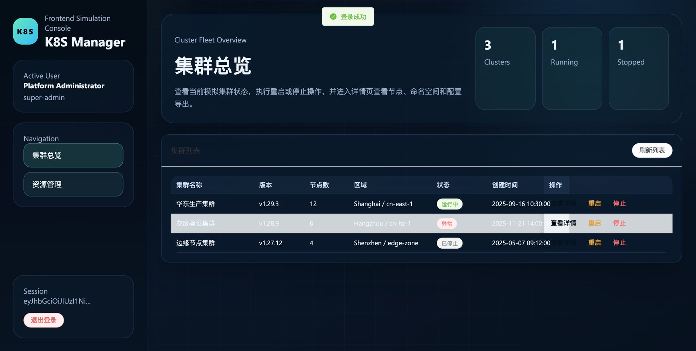

# K8s Manager - Kubernetes 集群管理平台

一个基于 Vue 3 + Element Plus 的 Kubernetes 集群管理界面，提供直观的集群监控和资源管理能力。


## 📸 功能特性

- 🖥️ **集群总览** - 查看多个 K8s 集群状态、版本、节点数
- 📊 **节点监控** - 实时显示节点 CPU/内存使用率
- 📦 **资源管理** - 管理命名空间、Deployments、Pods、Services
- 🔐 **登录认证** - 支持用户登录和权限控制
- 📱 **响应式设计** - 适配不同屏幕尺寸
- 🎨 **现代化 UI** - 基于 Element Plus 的精美界面

## 🖼️ 运行效果



_上图：集群总览界面，显示集群列表、状态标签和操作按钮_

## 🚀 技术栈

| 技术 | 版本 | 说明 |
|------|------|------|
| Vue 3 | 3.5.13 | 渐进式 JavaScript 框架 |
| Vite | 6.2.0 | 下一代前端构建工具 |
| TypeScript | 5.8.2 | JavaScript 的超集 |
| Element Plus | 2.9.7 | Vue 3 组件库 |
| Pinia | 2.3.1 | Vue 状态管理 |
| Vue Router | 4.5.0 | 官方路由管理器 |
| Axios | 1.8.4 | HTTP 客户端 |
| Mock.js | 1.1.0 | 模拟数据生成 |

## 📁 项目结构

```
k8s-manager/
├── src/
│   ├── api/              # API 接口定义
│   │   ├── http.ts       # HTTP 请求封装
│   │   ├── cluster.ts    # 集群相关 API
│   │   └── resource.ts   # 资源相关 API
│   ├── layouts/          # 布局组件
│   │   └── AppShell.vue  # 应用主布局
│   ├── mock/             # Mock 数据
│   │   ├── index.ts      # Mock 配置
│   │   └── data.ts       # 模拟数据
│   ├── router/           # 路由配置
│   │   └── index.ts
│   ├── stores/           # Pinia 状态管理
│   │   ├── auth.ts       # 认证状态
│   │   ├── clusters.ts   # 集群状态
│   │   └── resources.ts  # 资源状态
│   ├── types/            # TypeScript 类型定义
│   │   └── index.ts
│   ├── utils/            # 工具函数
│   │   └── storage.ts    # 本地存储工具
│   ├── views/            # 页面视图
│   │   ├── LoginView.vue         # 登录页
│   │   ├── ClustersView.vue      # 集群列表
│   │   ├── ClusterDetailView.vue # 集群详情
│   │   └── ResourcesView.vue     # 资源管理
│   ├── App.vue           # 根组件
│   ├── main.ts           # 入口文件
│   └── env.d.ts          # 环境类型声明
├── index.html
├── package.json
├── tsconfig.json
├── tsconfig.node.json
└── vite.config.ts
```

## 🛠️ 快速开始

### 环境要求

- Node.js >= 18.0.0
- npm >= 9.0.0

### 安装依赖

```bash
npm install
```

### 启动开发服务器

```bash
npm run dev
```

访问 http://127.0.0.1:5181/

### 构建生产版本

```bash
npm run build
```

### 预览生产构建

```bash
npm run preview
```

## 📖 功能说明

### 1. 集群管理
- 查看集群列表（名称、版本、节点数、区域、状态）
- 集群状态标签：运行中、异常、已停止
- 支持重启、停止集群操作
- 进入集群详情页查看详细信息

### 2. 集群详情
- **节点列表** - 显示 Master/Worker 节点状态、IP、资源使用率
- **命名空间** - 查看所有命名空间及其资源统计
- **配置导出** - 查看网络插件、Ingress、存储类等配置
- **可观测性** - 显示 Prometheus、Grafana 等监控工具

### 3. 资源管理
- **Deployments** - 查看和管理部署
- **Pods** - 查看 Pod 状态、节点、IP、重启次数
- **Services** - 查看服务类型、ClusterIP、端口映射

### 4. 数据持久化
- 使用 `localStorage` 保存集群数据
- 支持数据重置功能

## 🔧 开发指南

### 添加新集群

编辑 `src/mock/data.ts`，在 `defaultClusters` 数组中添加：

```typescript
{
  id: 'cls-new-001',
  name: '新集群名称',
  version: 'v1.29.0',
  nodeCount: 3,
  status: '运行中',
  createdAt: '2026-03-23 10:00:00',
  region: 'Beijing / cn-beijing-1',
  // ... 其他字段
}
```

### 连接真实 K8s API

1. 移除 Mock：在 `src/main.ts` 中注释掉 `import './mock';`
2. 配置 API：在 `src/api/http.ts` 中设置真实的 K8s API Server 地址
3. 添加认证：配置 Bearer Token 或证书认证

### 添加新页面

1. 在 `src/views/` 创建新组件
2. 在 `src/router/index.ts` 添加路由
3. 在 `src/layouts/AppShell.vue` 中添加导航菜单

## 📝 注意事项

- ⚠️ **当前使用 Mock 数据** - 演示用途，不连接真实 K8s 集群
- ⚠️ **认证功能未实现后端** - 登录状态仅保存在本地
- ⚠️ **操作不会真正影响集群** - 重启/停止仅为 UI 演示
- ⚠️ **数据存储在浏览器** - `localStorage`，刷新页面不会丢失，但清除缓存会丢失

---

## 🏭 生产环境改造方案

### 当前架构 vs 生产架构

| 组件 | 当前（Demo） | 生产环境 |
|------|-------------|---------|
| 数据存储 | localStorage（浏览器） | PostgreSQL / MySQL |
| API 请求 | Mock.js 拦截 | 真实后端 API |
| K8s 连接 | 无 | K8s API Server（kubeconfig） |
| 认证 | 本地 Token（假） | JWT / OAuth2 / SSO |
| 部署 | 本地开发服务器 | Docker / K8s + Nginx |

### 生产架构图

```
┌─────────────┐     ┌──────────────┐     ┌─────────────────┐
│   前端       │────▶│   后端 API    │────▶│  K8s API Server │
│  (Vue 3)    │     │  (Node/Go)   │     │   (真实集群)     │
└─────────────┘     └──────────────┘     └─────────────────┘
                           │
                           ▼
                    ┌──────────────┐
                    │   PostgreSQL  │
                    │   或 MySQL    │
                    └──────────────┘
```

### 改造步骤

#### 1️⃣ 选择后端技术栈

| 方案 | 语言 | 框架 | 数据库 | 优势 |
|------|------|------|--------|------|
| **轻量级** | Node.js | Express / NestJS | SQLite | 开发快，前后端同语言 |
| **标准** | Node.js | NestJS | PostgreSQL | 类型安全，适合企业 |
| **高性能** | Go | Gin / Echo | PostgreSQL | 性能好，K8s 生态友好 |
| **快速开发** | Python | FastAPI | MySQL | 开发效率高 |

#### 2️⃣ 后端 API 设计

```typescript
// 后端接口示例（Node.js + Express）
import express from 'express';
import * as k8s from '@kubernetes/client-node';

const app = express();

// 获取集群列表
app.get('/api/clusters', async (req, res) => {
  const kc = new k8s.KubeConfig();
  kc.loadFromDefault();
  
  const k8sApi = kc.makeApiClient(k8s.CoreV1Api);
  const nodes = await k8sApi.listNode();
  
  res.json({
    code: 200,
    data: nodes.body.items.map(node => ({
      name: node.metadata.name,
      status: node.status.conditions.find(c => c.type === 'Ready').status,
    }))
  });
});

// 获取 Pods
app.get('/api/resources/pods', async (req, res) => {
  const kc = new k8s.KubeConfig();
  kc.loadFromDefault();
  
  const k8sApi = kc.makeApiClient(k8s.CoreV1Api);
  const pods = await k8sApi.listPodForAllNamespaces();
  
  res.json({ code: 200, data: pods.body.items });
});

app.listen(3000);
```

#### 3️⃣ 前端改造

**修改 `src/main.ts`**
```typescript
// import './mock';  // 注释掉 Mock
```

**修改 `src/api/http.ts`**
```typescript
const http = axios.create({
  baseURL: 'http://your-backend-api.com/api', // 改为真实后端地址
  timeout: 10000,
});
```

**修改 `src/utils/storage.ts`**
```typescript
// 移除 localStorage 存储集群数据
// 改为从后端 API 获取
export async function loadClusters() {
  const response = await http.get('/clusters');
  return response.data;
}
```

#### 4️⃣ 连接真实 K8s 集群

**方式 A：单集群（kubeconfig 直连）**
```bash
# 后端服务器配置
export KUBECONFIG=/path/to/kubeconfig
```

**方式 B：多集群管理**
```typescript
// 数据库存储集群信息
interface Cluster {
  id: string;
  name: string;
  apiServer: string;
  kubeconfig: string; // 加密存储
  status: 'online' | 'offline';
}

// 按需连接不同集群
async function getClusterClient(clusterId: string) {
  const cluster = await db.clusters.findById(clusterId);
  const kc = new k8s.KubeConfig();
  kc.loadFromString(cluster.kubeconfig);
  return kc.makeApiClient(k8s.CoreV1Api);
}
```

#### 5️⃣ 数据库设计

```sql
-- 集群表
CREATE TABLE clusters (
  id VARCHAR(36) PRIMARY KEY,
  name VARCHAR(100) NOT NULL,
  api_server VARCHAR(255) NOT NULL,
  kubeconfig_encrypted TEXT NOT NULL,
  status VARCHAR(20) DEFAULT 'offline',
  created_at TIMESTAMP DEFAULT CURRENT_TIMESTAMP,
  updated_at TIMESTAMP DEFAULT CURRENT_TIMESTAMP ON UPDATE CURRENT_TIMESTAMP
);

-- 用户表
CREATE TABLE users (
  id VARCHAR(36) PRIMARY KEY,
  username VARCHAR(50) UNIQUE NOT NULL,
  password_hash VARCHAR(255) NOT NULL,
  role VARCHAR(20) DEFAULT 'user',
  created_at TIMESTAMP DEFAULT CURRENT_TIMESTAMP
);

-- 操作日志表
CREATE TABLE audit_logs (
  id VARCHAR(36) PRIMARY KEY,
  user_id VARCHAR(36) NOT NULL,
  action VARCHAR(50) NOT NULL,
  resource_type VARCHAR(50),
  resource_id VARCHAR(36),
  created_at TIMESTAMP DEFAULT CURRENT_TIMESTAMP
);
```

### 生产部署清单

- [ ] 搭建后端 API 服务（Node.js/Go）
- [ ] 配置数据库（PostgreSQL/MySQL）
- [ ] 准备 K8s kubeconfig 文件
- [ ] 修改前端 API 地址（`src/api/http.ts`）
- [ ] 移除 Mock 代码（`src/main.ts`、`src/mock/`）
- [ ] 实现真实认证（JWT/OAuth2/SSO）
- [ ] 配置 HTTPS（Let's Encrypt / 自签名证书）
- [ ] 部署到服务器（Docker Compose / K8s）
- [ ] 配置 Nginx 反向代理
- [ ] 设置监控告警（Prometheus + Grafana）

### Docker Compose 部署示例

```yaml
version: '3.8'

services:
  frontend:
    build: ./frontend
    ports:
      - "80:80"
    depends_on:
      - backend

  backend:
    build: ./backend
    environment:
      - DATABASE_URL=postgresql://user:pass@db:5432/k8s_manager
      - KUBECONFIG=/etc/k8s/config
    volumes:
      - ~/.kube/config:/etc/k8s/config:ro
    depends_on:
      - db

  db:
    image: postgres:15
    environment:
      - POSTGRES_DB=k8s_manager
      - POSTGRES_USER=user
      - POSTGRES_PASSWORD=pass
    volumes:
      - pgdata:/var/lib/postgresql/data

volumes:
  pgdata:
```

### 后端依赖（Node.js 示例）

```json
{
  "dependencies": {
    "@kubernetes/client-node": "^0.20.0",
    "express": "^4.18.0",
    "jsonwebtoken": "^9.0.0",
    "bcrypt": "^5.1.0",
    "pg": "^8.11.0",
    "dotenv": "^16.0.0"
  }
}
```

### 安全建议

1. **kubeconfig 加密存储** - 使用 AES-256 加密后存入数据库
2. **JWT Token 过期** - 设置合理过期时间（如 24 小时）
3. **RBAC 权限控制** - 根据用户角色限制 K8s 操作权限
4. **操作审计日志** - 记录所有 K8s 操作
5. **HTTPS 强制** - 生产环境必须使用 HTTPS
6. **CORS 配置** - 限制允许的源

---

## 🤝 贡献

欢迎提交 Issue 和 Pull Request！

## 📄 许可证

MIT License

---

**Made with ❤️ using Vue 3 + Element Plus**
